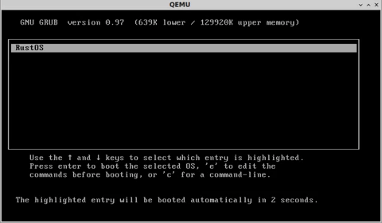

# RustOS
RustOS is a kernel written in Rust for IA-32 architecture

## User manual

### Linux configuration
    sudo apt-get install curl nasm qemu
    
### Rust configuration
    curl https://sh.rustup.rs -sSf | sh
    echo source $HOME/.cargo/env >> ~/.bashrc
    rustup override add nightly
    cargo install xargo
    rustup component add rust-src

### Build
    make build
    
### Usage
    make run
    
### Documentation
    make doc
    
## Resources
* [Rust book first edition](https://doc.rust-lang.org/book/first-edition)
* [Rust book second edition](https://doc.rust-lang.org/book/second-edition)
* [Cargo book](https://doc.rust-lang.org/cargo)
* [Writing an OS in Rust](https://os.phil-opp.com/first-edition)
* [Little OS Book](https://littleosbook.github.io)